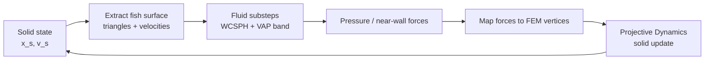

# Meta-zebrafish

**Explicit weak-coupling fluid-structure interaction (FSI) simulation for soft-bodied fish swimming.**

Meta-zebrafish simulates a deformable fish body driven by muscle activation waves in water. The solid side uses a tetrahedral soft-body FEM / Projective Dynamics formulation inspired by SoftCon-style biomimetic actuators; the fluid side uses GPU WCSPH with a near-wall VAP pressure projection layer; the coupling transfers fish surface motion to the fluid and maps fluid pressure forces back to FEM vertices.

The project is intended for research and course demonstrations of fish locomotion, soft-body mechanics, particle fluids, and FSI diagnostics.

## Highlights

- Soft fish body represented by a tetrahedral FEM mesh.
- Passive tissue elements plus active muscle units defined from nerve-cord / muscle polylines.
- Corotated FEM constraints for large rotations and soft-body deformation.
- Projective Dynamics style local-global solve for stable solid time stepping.
- GPU WCSPH fluid solver for moving-boundary water simulation.
- Near-wall VAP band projection for improved pressure coverage around the fish surface.
- Explicit weak FSI coupling: surface motion drives fluid, fluid pressure returns as vertex forces.
- Headless diagnostic tools for force snapshots, pressure coverage, volume preservation, and VAP particle traces.
- OpenGL viewer for interactive simulation visualization.

## Method Overview

The simulation follows an explicit weak-coupling loop:



The continuous FSI problem is approximated by solving the solid and fluid separately within each time step:

- **Solid side:** soft fish FEM with passive tetrahedral constraints and active muscle constraints.
- **Fluid side:** WCSPH particle fluid with a VAP pressure projection in a narrow band near the fish wall.
- **Interface:** fish surface triangles provide a moving boundary; integrated pressure forces are distributed back to surface FEM vertices.

## Repository Layout

| Path | Purpose |
|---|---|
| `sim/` | Core simulation library, solid model, environment, fluid bridge, tests |
| `sim/fem/` | FEM mesh, Projective Dynamics world, and constraints |
| `sim/fluid/` | GPU WCSPH / VAP fluid solver and FSI bridge |
| `render/` | OpenGL/GLUT viewer and rendering utilities |
| `data/` | Fish/worm meshes, sampling files, muscle or nerve-cord geometry |
| `args/` | Runtime / training-style argument files inherited from the original framework |
| `scripts/` | Sweep, analysis, and visualization utilities |

## Data Model

The default fish model is configured by `data/fish.meta`:

```text
0.004
fish_body.mesh
zf_nerve_cord.obj
fish.sampling
0 4072
6466 5760 5781
```

Meaning:

- `fish_body.mesh`: tetrahedral fish body mesh.
- `zf_nerve_cord.obj`: polyline geometry used to define active muscle / nerve-cord paths.
- `fish.sampling`: sampling vertex indices used by the simulation state.
- The last two lines define endpoint and local-frame reference indices.

For the current fish mesh:

| Quantity | Value |
|---|---:|
| Vertices | 7950 |
| Tetrahedra | 24676 |
| Surface triangles | Extracted from tetrahedral boundary |

## Core Algorithms

### Solid Mechanics

The fish body is discretized as tetrahedra. Each tetrahedron contributes passive elastic constraints. Muscle paths are sampled into active muscle segments and mapped to nearby or intersected tetrahedra through distance-weighted constraints.

Key ideas:

- Corotated FEM separates rigid rotation from true elastic deformation.
- Projective Dynamics solves the nonlinear soft-body problem through local projection and global sparse linear solves.
- Active muscle constraints generate internal strain instead of directly applying surface forces.

### Fluid Mechanics

The fluid is simulated with weakly compressible SPH:

```text
rho_i = sum_j m_j W_ij
p_i = rho_0 c_s^2 / 7 * ((rho_i / rho_0)^7 - 1)
```

Pressure and viscosity are evaluated from local particle neighborhoods. A uniform grid accelerates neighbor search on the GPU.

### VAP Near-Wall Projection

WCSPH can be noisy near moving solid boundaries because particle neighborhoods are incomplete. This project applies VAP only in a narrow band around the fish surface:

```text
A p = b
```

where `p` is the near-wall projection pressure, `b` is built from velocity divergence, boundary motion, and density compensation, and `A` is assembled implicitly from particle-neighbor weights.

Two design choices are important:

- **Band hybridization:** VAP is used near the fish wall, while bulk fluid remains WCSPH.
- **Kinematic ghost particles:** fish surface points enter the VAP neighborhood as moving boundary samples, but they are not pressure unknowns.

## Main Parameters

Typical default values in the current fish-FSI setup:

| Category | Parameter | Value |
|---|---|---:|
| Coupling | Solid simulation rate | `960 Hz` |
| Coupling | Control rate | `30 Hz` |
| Coupling | Fluid substeps | `18` |
| Coupling | Max vertex force | `5.0 N` |
| Solid | Young's modulus | `2e5` |
| Solid | Hard region Young's modulus | `4e5` |
| Solid | Poisson ratio | `0.4` |
| Solid | Muscle stiffness | `5e5` |
| Fluid | Particle spacing | `0.011` |
| Fluid | Rest density | `1000` |
| Fluid | Sound speed | `20` |
| VAP | Band radius | `2.5 h` |
| VAP | CG max iteration | `50` |
| VAP | CG tolerance | `0.1` |
| VAP | Ghost divergence scale | `0.02` |
| VAP | Ghost velocity scale | `0.05` |

## Build

### Dependencies

On Ubuntu-like systems, install the basic C++ / OpenGL / Python dependencies:

```bash
sudo apt-get update
sudo apt-get install build-essential cmake git
sudo apt-get install libeigen3-dev freeglut3-dev libpython3-dev python3-numpy
```

The project also uses:

- CUDA toolkit for the GPU fluid solver.
- Boost Python / Boost NumPy / Boost Filesystem.
- OpenMP if available.

The original SoftCon code expected Boost 1.66 built with Python support. Depending on your system distribution, a system Boost package may work, but source-built Boost is often safer for Python ABI compatibility.

### Configure and Compile

```bash
cmake -S . -B build
cmake --build build -j
```

Optional C302 / eworm interaction support:

```bash
cmake -S . -B build -DMETAWORM_ENABLE_EWORM=ON
cmake --build build -j
```

## Run

### Interactive Viewer

```bash
./build/render/metaworm
./build/render/metaworm sin
```

The `sin` / `sine` mode uses an external sine muscle activation pattern and is useful for demonstrations.

Common controls:

| Key / Mouse | Action |
|---|---|
| Space | Play / pause |
| `r` | Reset |
| `t` | Toggle tetrahedral mesh |
| `w` | Toggle fish body |
| `m` | Toggle muscles |
| `p` | Toggle trajectory |
| `x` | Toggle world coordinate frame |
| `c` | Toggle body local coordinate frame |
| `q` | Quit |
| Right mouse | Rotate camera |
| Middle mouse | Zoom |

### Headless Diagnostics

Quick FSI / pressure coverage check:

```bash
./build/hydro_30frame --seconds 0.5 --sim-hz 960 --substeps 18 --ramp 0.5
```

Export FSI force snapshots:

```bash
./build/fsi_force_snapshot --out build/fsi_snapshots --seconds 5 --substeps 18
```

Run an FSI parameter sweep:

```bash
bash scripts/run_fsi_sweep.sh
```

Generated snapshots, sweep summaries, and plots are usually written under `build/` or a local `result/` directory. Large experimental outputs are not required for building the simulator.

## Diagnostics

The simulation logs and test programs track:

- `volume_ratio`: current total tetrahedral volume divided by rest volume.
- `min_tet_ratio` / `max_tet_ratio`: local tetrahedral volume quality.
- `inverted_tets`: number of inverted tetrahedra.
- Surface hydro-force coverage.
- Contact / hydro / total force split.
- Torque about center of mass or selected reference points.
- VAP particle pressure, neighbors, residuals, and near-wall gap diagnostics.

## Notes on Project Origin

Parts of the solid-side framework are forked and modified from:

> Sehee Min, Jungdam Won, Seunghwan Lee, Jungnam Park, and Jehee Lee. 2019.  
> **SoftCon: Simulation and Control of Soft-Bodied Animals with Biomimetic Actuators.**  
> ACM Transactions on Graphics 38, 6, 208. SIGGRAPH Asia 2019.

This repository extends that style of soft-body / muscle-actuator simulation toward fish-body FSI with WCSPH and VAP-based near-wall pressure coupling.

## License

See `LICENSE` for repository license information. Please also respect the license and citation requirements of the original SoftCon project if reusing inherited components.
